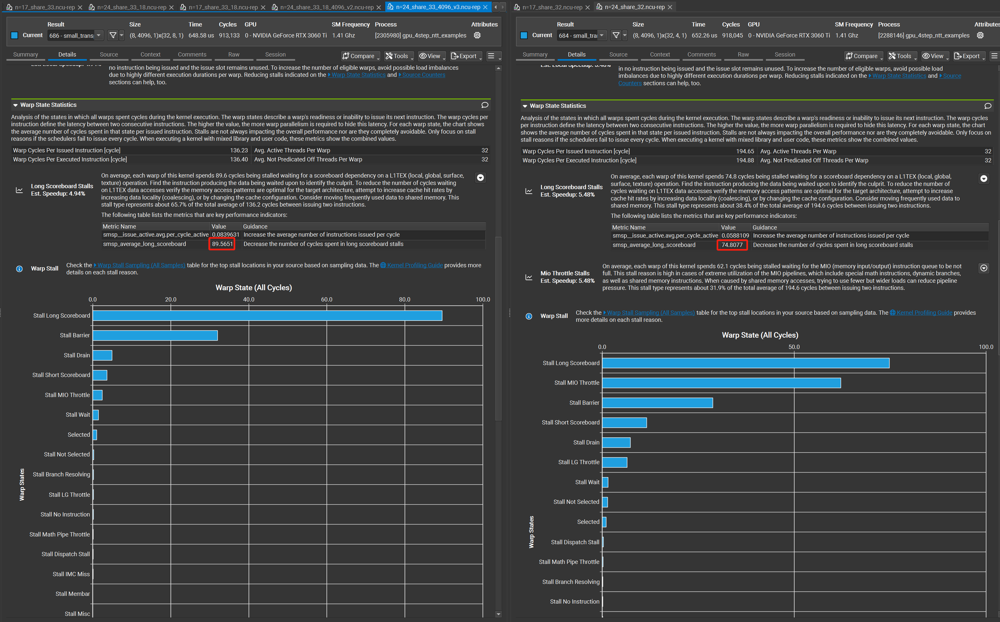

## 通过解决共享内存的存储体冲突以提高矩阵转置的速度
| 维度n | 17 前 | 17 后 | 24前 | 24后 |
| :-----: | :-----: | :-----: | :-----: | :-----: |
|  Transpose Batch | 8.53 us | 6.50 us| 0.66 ms | 0.7 ms|
|  small_transpose_4096_W | 9.89 us | 9.09 us | 0.97ms | 0.97ms|
| small_transpose_mult_4096 | 8.29 us | 7.55 us |0.65ms | 0.65 ms| 
|  small_transpose_4096 |  |  | 0.65 ms |  0.65ms | 
|  small_transpose_4096_v2 |  |  | 0.66 ms |  0.65ms | 
|  small_transpose_4096_v2 |  |  | |  0.65ms | 

### small_transpose_4096_v2
减少每个线程处理的共享内存数量试图减少由于scoreboard对于共享内存的依赖问题

使用small_transpose_4096_v3,使得每个线程处理2个数据，但是由于scoreboard warp stall的影响却在进一步地加剧

进一步阅读，发现scoreboard是由于全局内存的局部性不够引起的
>On average, each warp of this kernel spends 74.8 cycles being stalled waiting for a scoreboard dependency on a L1TEX (local, global, surface, texture) operation. Find the instruction producing the data being waited upon to identify the culprit. To reduce the number of cycles waiting on L1TEX data accesses verify the memory access patterns are optimal for the target architecture, attempt to increase cache hit rates by increasing data locality (coalescing), or by changing the cache configuration. Consider moving frequently used data to shared memory. This stall type represents about 38.4% of the total average of 194.6 cycles between issuing two instructions.

但是函数small_transpose_4096却是理论上能够达到合并内存访问的,且解决了存储体访问冲突,为什么就是速度没有呢

## 进一步优化64维NTT
TODO: 1.解决共享内存的存储体冲突
      2.合并全局内存的内存访问 ->应该是共享内存的
      3.CT操作较为耗时,应该如何掩盖

### 32个线程64维NTT的实验结果
#### 存储体冲突的实验结果

|| 1 * 4 有存储体冲突 | 1 * 4 无存储体冲突 |  512 * 4有 | 512 * 4无 | 65536 * 4 有 | 65536 * 4 无|
| :-----: | :-----: | :-----: | :-----: | :-----: | :-----: | :-----: |
|耗时|3.39 us |3.52 us| 11.07us|10.14us| 856.42us |824.74 us|
|达到的occupancy|8.28 % |8.23%| 72.7% |71.82%| 94.64% |95.28%|
|理论上的occupancy|100 % |100% | 100% |100%| 100% | 100% |
> 解决存储体冲突并没有带来太大的时间改进

#### 定位耗时原因

##### 2.对于全局内存的访问
###### 2.1 删除了所有的
||前|后|
| :-----: | :-----: | :-----: |
512 * 4无 |10.14us | 8.76us
1 * 4无 |3.52us  | 3.23us

###### 2.2 只删除对于旋转因子的访问

||前|后|
| :-----: | :-----: | :-----: |
512 * 4无 |10.14us | 9.98us 
1 * 4无 |3.52us  | 3.30us 
65536 * 4 无| 824.74 us|819.62 us

###### 2.3 删去蝴蝶操作

||前|后| 
| :-----: | :-----: | :-----: |
512 * 4无 |10.14us | 6.21us 
1 * 4无 |3.52us  | 2.53us | 
65536 * 4 无| 824.74 us|649.66 us

在删去蝴蝶操作的基础上，删去对于共享内存的访问
||前|后| 后后|
| :-----: | :-----: | :-----: | :-----: |
512 * 4无 |10.14us | 6.21us |1.92us|
1 * 4无 |3.52us  | 2.53us | 1.44us|
65536 * 4 无| 824.74 us|649.66 us | 60.61us|

> 鉴于此，考虑使用寄存器代替共享内存,完成NTT操作

### 8个线程64维NTT的实验结果
主要是基于寄存器,减少对于共享内存的访问

||未优化存储体冲突| 已优化存储体冲突|
| :-----: | :-----: | :-----: |
|耗时|13.38us||
|理论占用率|33.33%||
|实际占用率|21.99%||

未优化存储体冲突的占用率分析如下所示,过小的block和过大的共享内存的不平衡导致了占用率过小

> 增大维数，使用256维的NTT操作作为基底

## 256维NTT
首先查看占用率，理论上能够道道100%

||实现时间|
| :-----: | :-----: |
|oroginal|3.97 + 9.63 + 12.10 = 25.7 us|
|每个block处理2个256维 + 单独转置| 4.13 + 10.34 + 3.9 + 12.48 = 30.85 us|
|每个block处理2个256维 + 合并转置| 3.84 + 12.96 + 12.51 = 29.31 us|
|每个block处理4个256维 + 单独转置| 4.06 + 11.52 + 4.19 + 13.22 = 32.99 us|
|每个block处理4个256维 + 合并转置| 3.9 + 14.11 + 13.02 = 31.03 us|

## 对于更高维度的NTT，这里是如何实现的呢?
### FourStepPartialForwardCore1函数图解
下面两张图从设计的理念出发，介绍了设计的初衷

注意配合原代码注释食用

## 论文阅读笔记
对于n较大的情况，存在一个block中的最大线程数量无法满足所需进行的蝴蝶操作数量的问题

## 遇到的问题

为什么共享内存大的那方，预期的SM的数量确更大呢？
