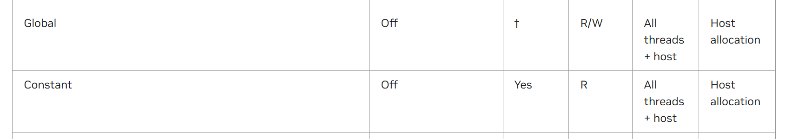

## 1.看完论文里关于高维NTT的实现细节
思考:
对于高维NTT，需要平衡kernel的数量和每一个kernel所完成的层数。理论上来说，每一个kernel完成的层数越多，那么需要使用的kernel越少，对于全局内存的访问次数也就越小，但是层数越多，会使得一个block内，对于全局内存的访问是分散的。结论是，如果/kernel对于全局内存的访问模式是较优秀的，那么可以考虑减少每一层所做的NTT层数，增加kernel的数量，这在一定程度上会提高效率。

那么对于4-stepNTT，矩阵转置的操作就是最为耗时的。
4-step一定程度上增加了数据的局部性访问，那么在设计访问模式的时候，就应该将转置操作设计成全局内存友好的。->再去设计一下子

## 2.将64维的旋转因子放置在constant内存中
全局作用域存在不知道放在那个头文件中的问题

因此打算将其作为一个函数指针，在不同的kernel中进行传递
传递了数据之后发现存在原先的和自己的都计算错误的情况，怀疑是传递

下面对如何使用全局内存进行测试
```cpp
#include <cuda_runtime.h>
#include <iostream>
using namespace std;
// 全局作用域中声明 __constant__ 变量
__constant__ float myConstData[100];

// 定义一个 kernel 函数，接受指向 constant 内存的指针
__global__ void kernelFunction(const float *constData) {
    int idx = threadIdx.x + blockIdx.x * blockDim.x;
    //printf("%d\n",idx);
    if (idx < 100) {
        float constValue =  constData[idx]; // 访问 constant memory //hxw:使用constData时无输出，使用myConstData时，有相应的输出
        // 使用 constValue 进行计算...
        printf("%f\n",constValue);
    }
}

void setupAndLaunchKernel() {
    // 主机端数据
    float hostData[100];

    // 初始化 hostData...
    for (int i = 0; i < 100; ++i) {
        hostData[i] = i;
    }

    // 将数据从主机复制到设备上的 constant 内存
    cudaMemcpyToSymbol(myConstData, hostData, sizeof(float) * 100);

    // 设置 block 和 grid 尺寸并启动 kernel
    dim3 dimBlock(16);  // 每个 block 的线程数
    dim3 dimGrid(6);    // block 的数量
    kernelFunction<<<dimGrid, dimBlock>>>(myConstData); // 传递 constant 内存的地址

    cudaDeviceSynchronize(); // 确保 kernel 执行完毕
    printf("kerenl done\n");
}

int main() {
    setupAndLaunchKernel();
    return 0;
}
```

[别人的代码也是使用全局域的方式进行访问而非使用指针](https://blog.csdn.net/qq_24990189/article/details/89597750)
### 2.1 CMakeList.txt组织的知识点总结
CmakeList.txt
### 2.2 使用常量内存带来的效益提升
|| 32 * 4 全局 | 32 * 4 常量 |  512 * 4全局  | 512 * 4常量 | 65536 * 4 全局 | 65536 * 4 常量|
| :-----: | :-----: | :-----: | :-----: | :-----: | :-----: | :-----: |
|耗时| 3.36us |4.45 us| 9.98us|12.35us| 825.34us |851.2 us|
|达到的occupancy|8.46 % |8.26%| 71.39% |78.44%| 94.70% | 93.06%|
|理论上的occupancy|100 % |100% | 100% |100%| 100% | 100% |

> 没有带来性能的提升，甚至是带来了性能的下降.但是根据指南中的表示 "Global, local, and texture memory have the greatest access latency, followed by constant memory, shared memory, and the register file."常量内存应该是能够带来性能的提升的



如下所述，只有当一个warp里的线程读取相同或者相近的内存地址时，才能获得效益的提升
There is a total of 64 KB constant memory on a device. The constant memory space is cached. As a result, a read from constant memory costs one memory read from device memory only on a cache miss; otherwise, it just costs one read from the constant cache. Accesses to different addresses by threads within a warp are serialized, thus the cost scales linearly with the number of unique addresses read by all threads within a warp. **As such, the constant cache is best when threads in the same warp accesses only a few distinct locations**. If all threads of a warp access the same location, then constant memory can be as fast as a register access.

[常量内存读取时存在一次读取在16个warp中进行广播的情况](https://blog.csdn.net/JustForYouForDL/article/details/106385160)

[当处理Constant Memory时，NVIDIA硬件把单次内存读取操作广播到每个半线程束（Half-Warp），即16个Thread。如果在Half-Warp中的每个Thread都从Constant Memory的相同地址上读取数据，那么GPU只会产生一次读取请求并在随后将数据广播到每个Thread。如果从Constant中读取大量的数据，那么这种方式产生的内存流量只是使用Global Memory的1/16（6%）.在读取Constant Memory时，所节约的不仅限于减少了94%的带宽，由于这块内存的内容是不会发生变化的，因此硬件将主动把这个常量数据缓存在GPU上。在第一次从常量内存的某个地址上读取后，当其他Half-Warp请求同一个地址时，那么将命中缓存，这同样也减少了额外的内存流量。](https://blog.csdn.net/qq_24990189/article/details/89597750)

故，只有当16个Thread每次都只需要相同的读取请求时，才值得讲这个读取操作广播到16个Thread。然而，如果Half-Warp中的所有16个Thread需要访问Constant Memory中不同的数据，那么这个16次不同的读取操作会被串行化，从而需要16倍的时间来发出请求。但如果从Global Memory中读取，那么这些请求会同时发出。在这种情况下，从Constant Me

