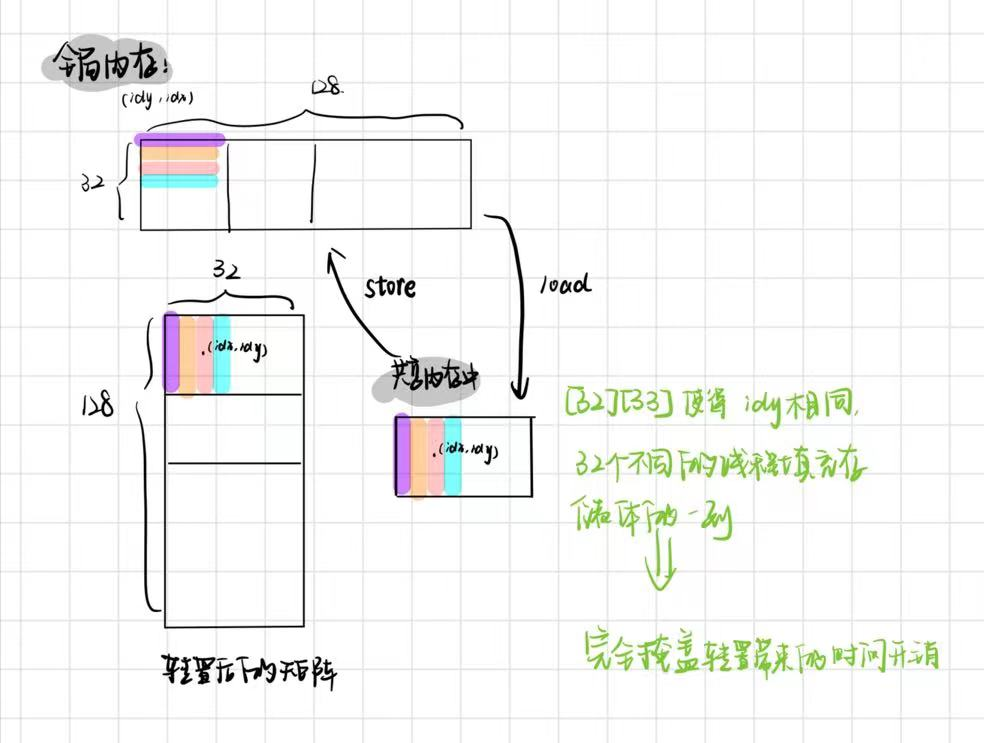
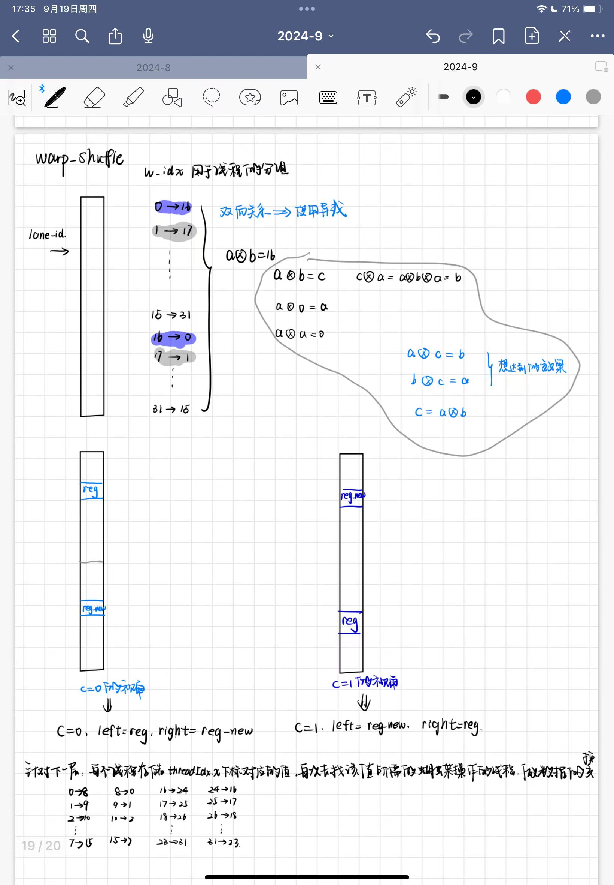

## 通过解决共享内存的存储体冲突以提高矩阵转置的速度

修改后的transpose函数，解决了存储体冲突
| 维度n | 17 后 | 24后 |
| :-----: | :-----: | :-----: |
|  batch 1 | 6.02 us | 651.74us|
|  batch 1 | 6.02 us | 1300 us|


## cyclic_5 = transpose_matrix + FourStepForwardCoreT1
5.79 us <-> 2.69 + 5.73 = 8.42 -> **时间减少了 31.23%**

想法:不对原先的矩阵做转置，而是直接在解决存储体冲突的基础上，直接按列存储到共享内存中，从而直接避免了转置操作


|维度n|原先耗时|现在耗时|时间减少|
| :-----: | :-----: | :-----: | :-----: |
|12|2.66+5.78+4.70+2.62 = 15.76 us| 5.70+4.67 = 10.37 us | 34.21%
|13|2.72+5.73+5.18+2.72 = 16.35 us| 5.79+5.06 = 10.85 us | 33.64%
|14|3.10+5.76+6.11+3.04=18.01 us| 6.02 + 6.34 = 12.36 us | 31.38%
|15|3.65+7.23+7.55+3.71 = 22.14 us |6.40 + 9.41 = 15.81 us(基于cyclic_5) 或 7.23 + 7.65 = 14.88 us | 28.59% 或者32.80% 
|16|5.09+9.73+12.10+5.18 = 32.1us |
|17| 8.16 + 12.19+12.10+15.26+8.10 = 55.81 us |12.03 + 12.32 + 15.26 = 39.61us | 29.03%
|18| 13.28 + 19.46 + 21.60 + 24.67 + 13.50 = 92.51 us | 20.03 + 21.22 + 24.83 = 66.08 us | 28.57%
|19| 23.04 + 31.36 + 38.40 + 44.96 + 22.82 = 160.58 us |30.69 + 37.95 + 45.02 = 113.66 us | 29.22%
|20 |43.39 + 52.86 + 78.50 + 84.61 + 43.46 = 302.82 |53.95 + 77.34 + 84.42 = 215.71 us | 28.77%
|21|84.80 + 111.84 + 146.50 + 160.22 + 84.99 = 588.35 us| 113.09 + 145.50 + 159.97 = 418.56 us | 28.86%


### n=15 之 cyclic_10优化
v1:6.37+11.65 = 18.02 us 83.33%->8.31%

v2:6.40 + 9.41 = 15.81 us 100%->16.35%

v3:6.3 + 15.14 = 21.44

#### 基于warp shuffle来减少对于共享内存的交换 v3版本
[warp shuffle的使用介绍](https://blog.csdn.net/kunhe0512/article/details/125492263)

```cpp
/*2024-9-19:
测试warp shuffle功能
<<<,dim3(32,8)>>>*/
__global__ void shuffle_test(){
    int coes[4];
    int j = threadIdx.x / 2;
    for(int i=0;i<4;i++) coes[i]= i; //threadIdx.x * 10 + i;
    printf("%d %d %d %d %d\n",coes[0],coes[1],coes[2],coes[3],threadIdx.x/2);
    __syncthreads();
    int s_x = __shfl_sync(0xffffffff,coes[j],threadIdx.x&1,8);

    printf("%d %d\n",threadIdx.x,s_x);//输出交换的结果
}
```
上述代码中，当使用__shfl_sync(0xffffffff,coes[j],threadIdx.x&1,8);进行数据间的交互时，存在j被处理为0的情况。若j被赋为一个常值，则能够正确访问目标线程的对应的coes寄存器。->因此使用数组似乎不是一个比较明智的选择。

因此，基于sy代码学习如何使用warp shfl。将其实现思路整理如下图,具体来说:每个线程掌握一个系数(对应下标为threadIdx.x)，因此需要32个系数，每个线程在做蝴蝶操作之前,通过__shfl_xor_sync操作，获取另一个值。在做完蝴蝶操作之后，再存储对应位置的值即可。


当线程组织结构为<<<,dim3(32,8)>>>时，所需花费的时间为6.3 + 15.14 = 21.44us ; 当线程组织结构为<<<,dim3(32,4)>>>时,所花费的时间为6.3+25.44 = 31.74us

分析觉得，可能是由于不同的线程，其在一个Warp内时，访问的旋转因子完全不同导致的->如果存储到共享内存中呢


### 量化每一个指标

## TODO1:后续能否使用矩阵转置
感觉写出一个新的组织没有之前的好，那么后续能否使用优化过的矩阵转置来做，进一步提升效率

## 负折叠卷积NTT的实现结果
| 维度n | 耗时 us |
| :-----: | :-----: |
|12|6.05+4.74 = 10.79|
|13 |6.08 + 5.41 = 11.49|
|14| 6.3 + 6.08 = 12.38|
|15| 6.75 + 8.99 = 15.74 或者 7.42+7.81 = 15.23|
|17| 12.16 + 11.84 + 15.26 = 39.26|
|18| 20 + 21.09 +24.77 = 65.86|
|19| 31.58 + 38.18 + 44.96 = 114.72|
|20| 